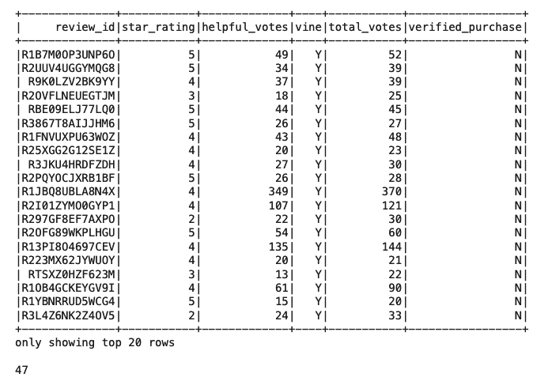

# Amazon_Vine_Analysis

##Determine any bias of Vine Reviews

###Data analysis on Amazon's watch Vine VS Non Vine reviews

	
	1. 	Extract Watch Review data
	2.	Transform Watch Data 
	3.	Load clean data

### Results
Amazon Watch review data (96K Extracted)

Total Vine review 		= 47 (image below)

Total non-Vine Reviews	= 9337 (image below)

Percentage of vine/non vine reviews (image below)

-
## Summary

The data shows there is little different with 5-star rating between Vine and non Vine reviews 